# 🎙️ AI Voice Authentication & Deepfake Detection System  

🚀 **Secure | Intelligent | Real-Time Voice AI Platform**

---

## 📌 Overview

This project is an advanced AI-powered system that enables **secure voice-based authentication** and **deepfake audio detection**, enhanced with **speaker intelligence, conversational verification, and multi-agent AI capabilities**.

With the rapid rise of synthetic voices, this system ensures **trustworthy identity verification** using cutting-edge machine learning and audio processing techniques.

---
## 🧠 Model Architecture

The system supports multiple model architectures for robust performance:

- 🌲 Random Forest (baseline model)
- 🔁 LSTM models for sequential audio feature learning
- 🧱 CNN models for spatial feature extraction
- 🔗 CNN-LSTM hybrid models for combined spatio-temporal learning

Each model is exposed via dedicated API endpoints for modular and scalable inference.

## 🔌 API Endpoints

The system provides multiple REST API endpoints for model inference:

- `/predict_rf` → Random Forest model  
- `/predict_lstm_csv` → LSTM model  
- `/predict_cnn_combined` → CNN model  
- `/predict_cnn_lstm_combined` → Hybrid CNN-LSTM model  

Each endpoint returns:
- Prediction (Real / Deepfake)
- Confidence score
- Timestamp
  
## 🔥 Key Features

### 🔐 Voice Authentication
- MFCC-based speaker verification  
- Cosine similarity matching  
- Upload & live voice authentication  

### 🧠 Speaker Intelligence
- Unique voice feature extraction  
- Personalized voice profile storage  
- Voice similarity scoring  

### 🗣️ Conversational Authentication
- Natural user interaction with passphrase  
- Speech-to-Text based verification  

### 🎭 Deepfake Detection
- Detects AI-generated vs real human voice  
- Uses **multiple machine learning and deep learning models**:
  - Random Forest (baseline)
  - LSTM-based models (temporal learning)
  - CNN-based models (feature extraction)
  - Hybrid CNN-LSTM models (spatio-temporal learning)  
- Confidence score prediction  
- Waveform & spectrogram visualization  

### 🌍 Speech Translation
- Converts speech to text  
- Multi-language translation support  

### 🤖 Multi-Agent AI System
- Qwen Agent  
- Whisper Agent  
- DeepSeek Agent  
- Multi-Agent reasoning system  

### 📊 Analytics Dashboard
- Authentication logs  
- Usage trends  
- Model performance metrics  

### 🎧 Additional Features
- Speaker diarization  
- Podcast generation & management  
- Emotion simulation  
- Voice command agent  

---

## 🏗️ System Architecture

1. 🎙️ Voice Input (Upload / Live Recording)  
2. 🧹 Audio Preprocessing (Noise Reduction)  
3. 📊 Feature Extraction (MFCC)  
4. 🔍 Speaker Verification (Cosine Similarity)  
5. 🎭 Deepfake Detection Model  
6. 📈 Visualization & Results Dashboard  

---

## 🧰 Tech Stack

- Python
- Flask  
- Librosa  
- Scikit-learn / NumPy / Pandas
- TensorFlow / Keras (Deep Learning)
- Whisper  
- gTTS  
- Plotly & Matplotlib  
- SQLite  
- HTML, CSS, JavaScript  

---

## 📁 Project Structure
ai-voice-authentication-deepfake-detection/
│
├── app.py
├── agents.py
├── requirements.txt
├── README.md
├── .gitignore
│
├── templates/
├── static/
├── utils/
├── models/


---

## ⚙️ Installation & Setup

### 1️⃣ Clone Repository
```bash
git clone https://github.com/Sowmya-2348562/ai-voice-authentication-deepfake-detection.git
cd ai-voice-authentication-deepfake-detection

2️⃣ Create Virtual Environment
python -m venv venv

Activate:

Windows:
venv\Scripts\activate
Mac/Linux:
source venv/bin/activate

3️⃣ Install Dependencies
pip install -r requirements.txt

4️⃣ Setup Environment Variables
Create .env file:
GROQ_API_KEY=your_api_key_here

5️⃣ Run the Application
python app.py

📸 Screenshots


## Screenshots


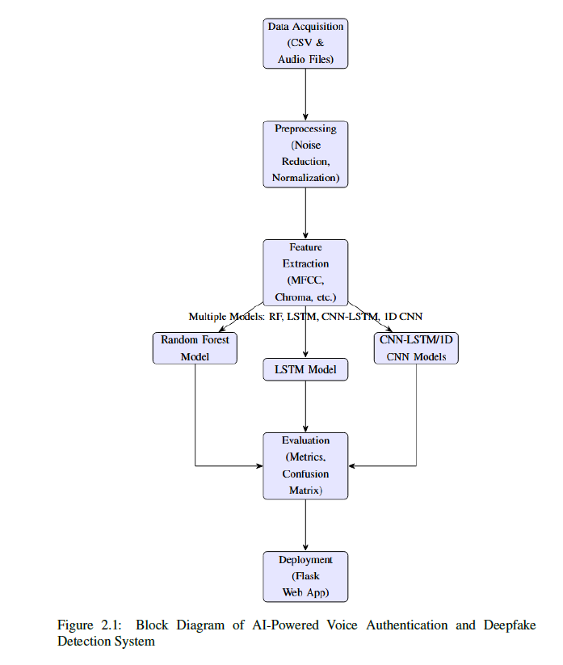

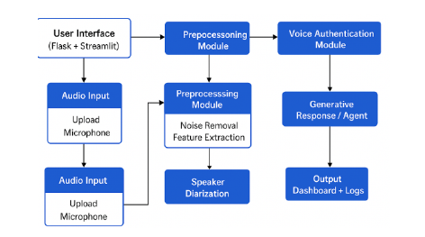

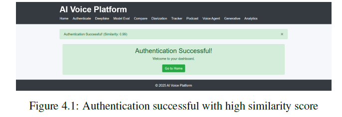

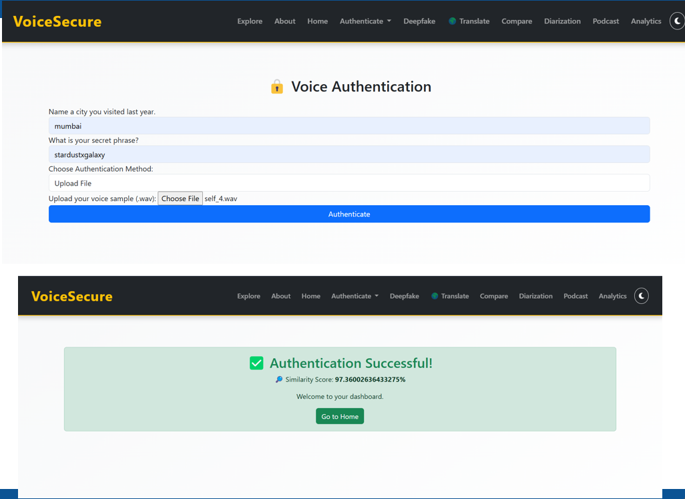

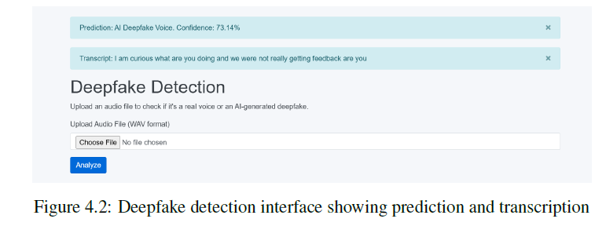

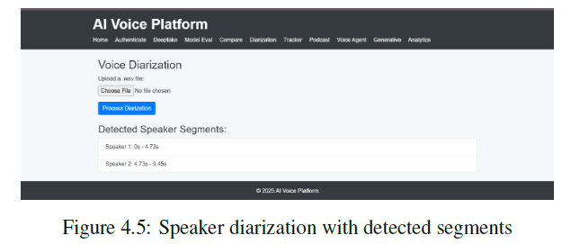

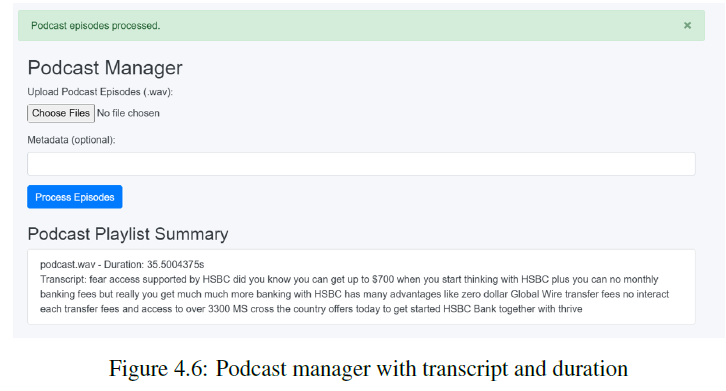

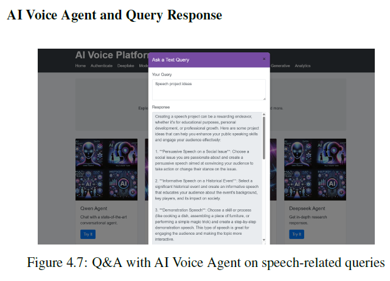

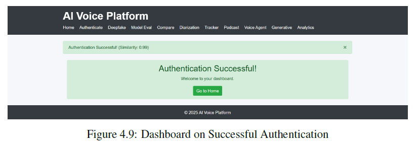

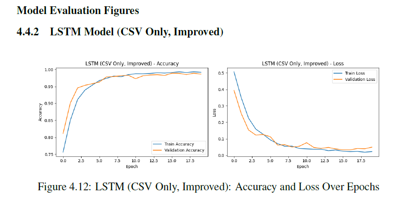

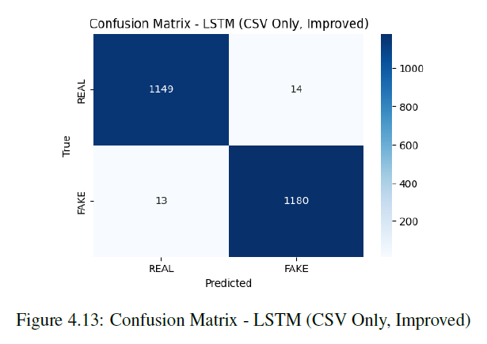

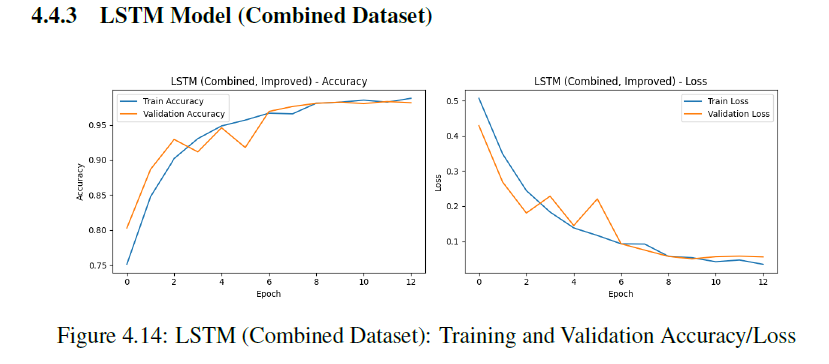

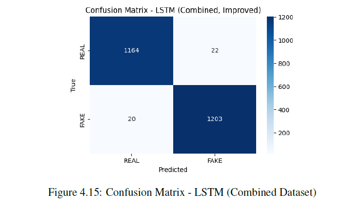

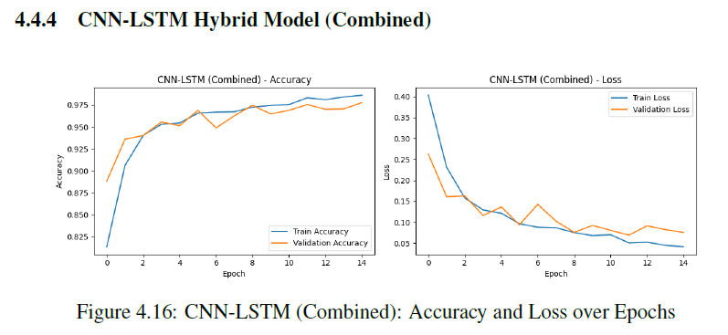

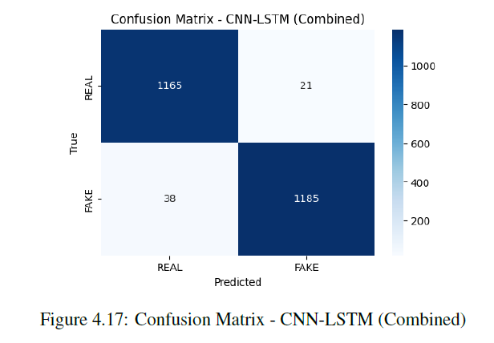

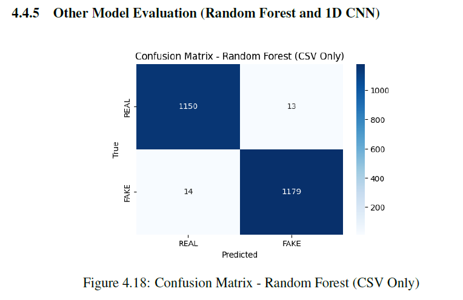

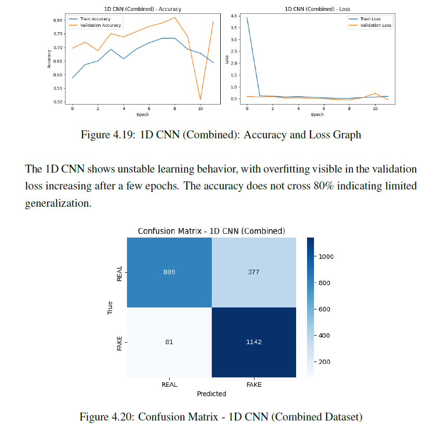


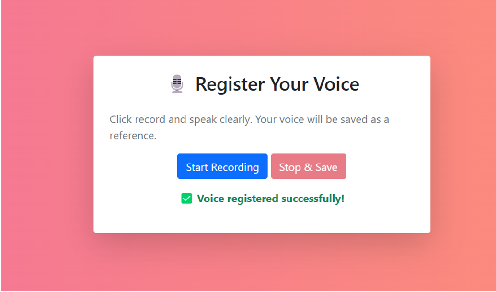

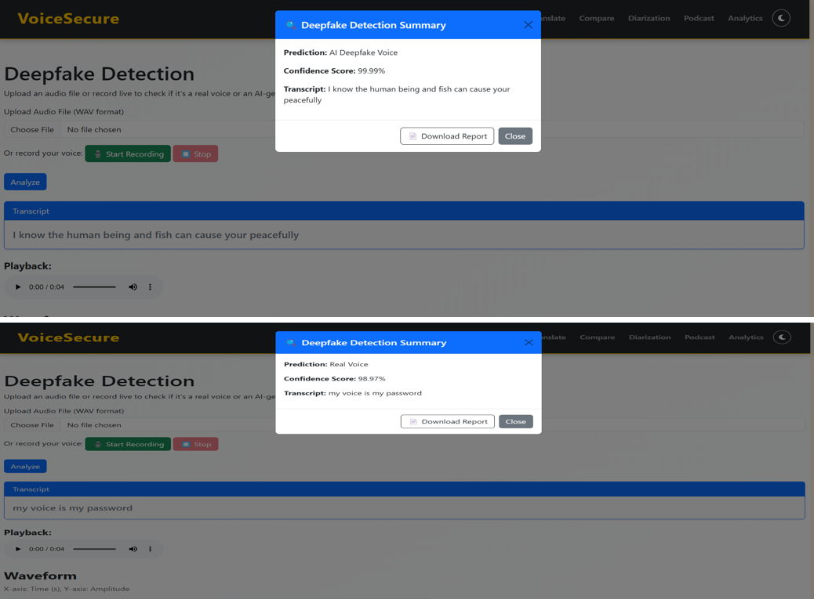

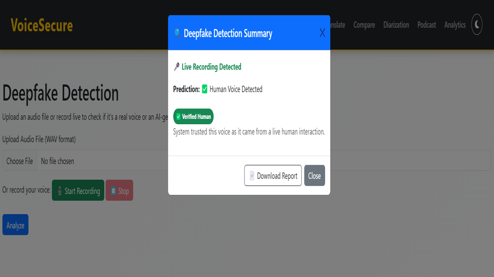

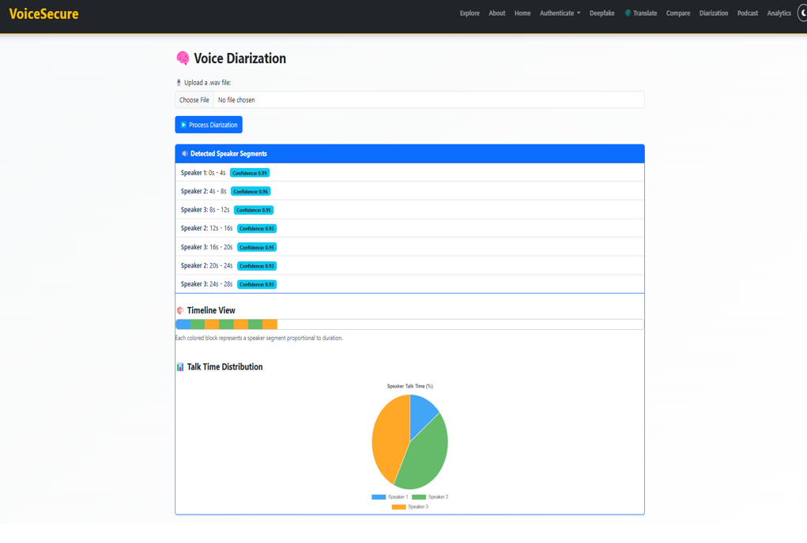

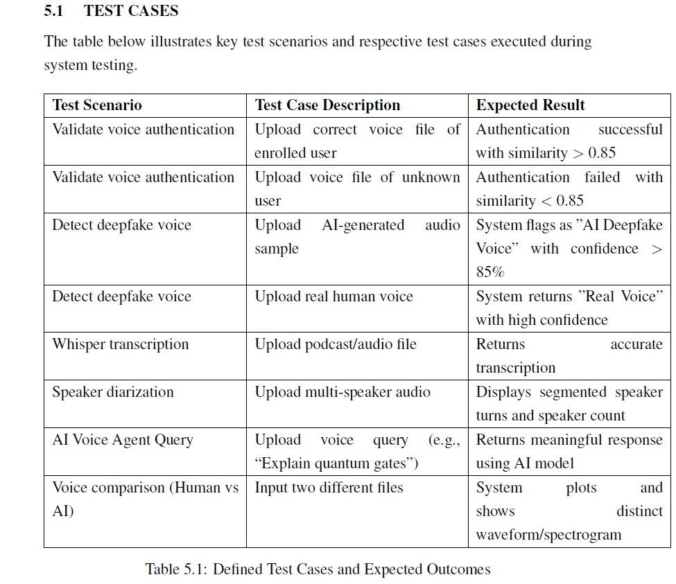


⚠️ Important Notes
.env file is not included
Large model files may not be included
Some features use external APIs

## 💡 Use Cases

- 🔐 Secure login using voice biometrics  
- 🏦 Fraud detection in banking & finance  
- 🎙️ Deepfake voice detection for media verification  
- 🧑‍💻 Identity verification in remote systems  
- 🌍 Multilingual voice-based applications

## 👩‍💻 Author

**Sowmya C**  
AI | NLP | Generative AI Enthusiast

## 🌟 Why This Project Matters

With the rise of AI-generated voices, traditional authentication systems are vulnerable.  
This project addresses real-world challenges by combining **voice biometrics, deepfake detection, and AI intelligence** into a single unified platform.


